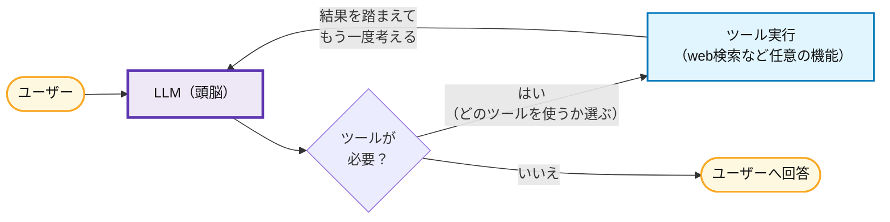

```mermaid
flowchart LR
    classDef brain fill:#ede7f6,stroke:#5e35b1,stroke-width:3px,color:#111
    classDef tool fill:#e1f5fe,stroke:#0277bd,stroke-width:2px,color:#111
    classDef io fill:#fff8e1,stroke:#f9a825,stroke-width:2px,color:#111

    U([ユーザー]):::io
    LLM["LLM（頭脳）"]:::brain

    U --> LLM
    LLM --> Q{"ツールが<br>必要？"}
    Q -->|はい<br/>（どのツールを使うか選ぶ）| T["ツール実行<br/>（web検索など任意の機能）"]:::tool
    T -->|結果を踏まえて<br/>もう一度考える| LLM
    Q -->|いいえ| R([ユーザーへ回答]):::io
```
