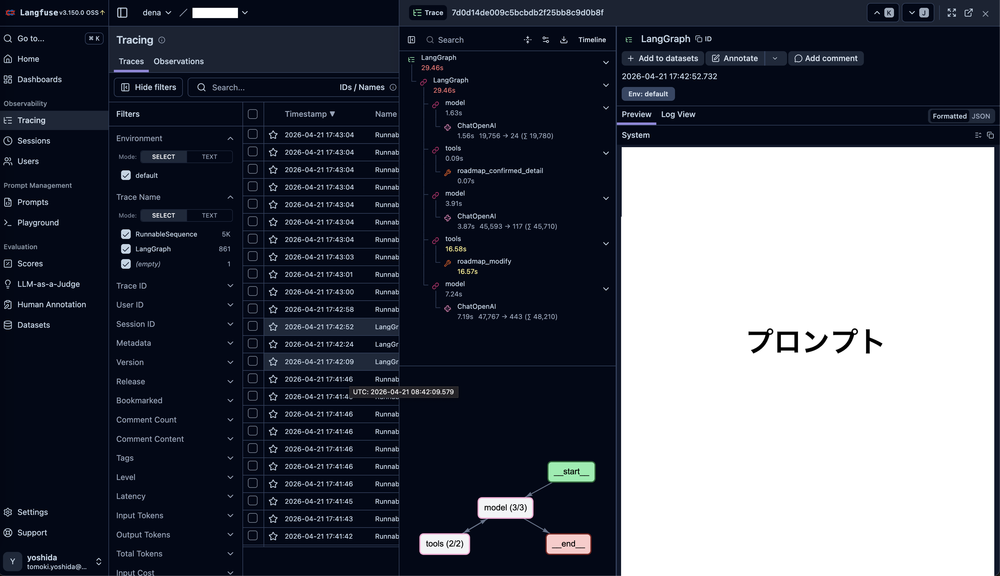

<!-- 時計/タイマー -->
<script src="timer.js"></script>

<!-- タイトルのみページ番号スキップ -->
<!-- _paginate: skip -->
<!-- 中央寄せ -->
<!-- _class: vertical-center -->

<div class="flex vertical-center">
<div>

# そのライブラリ、モデルと相性いいですか？
### 細かいけど効く 相性や設計など
### DeNA
AI技術開発部AIイノベーショングループ
吉田 知貴

2026-09-29

</div>

</div>

---

# 自己紹介

<div class="flex vertical-center">
<div>

### 吉田 知貴（birder）
<div class="text-center">


</div>

</div>

<div class="small">

- 学生時代
    - 機械学習凸最適化の高速化 ([KDD2018](https://www.kdd.org/kdd2018/accepted-papers/view/safe-triplet-screening-for-distance-metric-learning), [KDD2019](https://www.kdd.org/kdd2019/accepted-papers/view/learning-interpretable-metric-between-graphs-convex-formulation-and-computa))
    - 2018年 DeNAサマーインターン
- 社会人
    - 2020年 DeNA新卒入社
    - エネルギー事業（組み合わせ最適化）
    - ライブ配信Pococha（[CS審査効率化、レコメンド](https://www.docswell.com/s/DeNA_Tech/K4V978-aiday-specific-1500)）
    - **新規AIプロダクト開発**（英語、マチアプ、受験、音声対話など）

<span class="text-right">

Qiita: [@birdwatcher](https://qiita.com/birdwatcher)
X: [@birdwatcherYT](https://x.com/birdwatcheryt)
</span>

</div>
</div>

---
<!-- _paginate: skip -->
<!-- _class: vertical-center -->

# 目次

<div class="large">

1. **エージェントの基礎**
2. **構造化出力のストリーミング**
3. **モデル・ライブラリの比較と選定**
4. **マルチエージェントの連携方式**
5. **推論エンジンの性能比較**

</div>

---
<!-- _paginate: skip -->
<!-- _class: vertical-center -->
# エージェントの基礎

---
# エージェントとは？

- LLMを頭脳としたループが回る
- 事前に定義した**ツールを自律的に駆使**して応答する


---

# エージェント実装の基本形（LangChain）
<!-- from langchain.agents import create_agent
from langchain_core.tools import tool
from langchain_openai import ChatOpenAI
from pydantic import BaseModel, Field -->
```python
# ① 応答形式の定義
class AgentOutput(BaseModel): 
    reply: str = Field(description="応答文")
    suggestions: list[str] = Field(default_factory=list, description="選択肢")
# ② 自作ツール定義
@tool
def add(a: int, b: int) -> int:
    """2つの整数の和を返す""" # docstringがプロンプトに入る
    return a + b
# ③ モデル
llm = ChatOpenAI(
    model="gpt-5.6-sol",
    use_responses_api=True, # OpenAI の built-in ツール（例: web_search）を使うとき
)
# ④ エージェントが使えるツール集合定義
tools: list = [{"type": "web_search"}, add]
agent = create_agent(model=llm, tools=tools, response_format=AgentOutput)
```

---
# エージェント開発で便利なトレースツール

ローカルで**LangFuse**を利用: エージェントがどんな動きをしているか知れる

<div class="flex vertical-center">
<div>



</div>
<div class="small">

1. ツール選択
    by LLM（Cloud）
2. ツールA実行（**Local**）
3. ツール選択
    by LLM（Cloud）
4. ツールB実行（**Local**）
5. 応答 by LLM（Cloud）

</div>
</div>


---
<!-- _paginate: skip -->
<!-- _class: vertical-center -->
# 構造化出力のストリーミング

---
# 構造化出力のストリーミング

フィールド単位だけでなく、フィールド内でもストリーミングしたい
<div class="tiny">

```json
{}
{"name": ""}
{"name": "I"}
{"name": "I am"}
{"name": "I am a bird"}
{"name": "I am a bird."}
{"name": "I am a bird.", "age": 3}
{"name": "I am a bird.", "age": 3, "like": ""}
{"name": "I am a bird.", "age": 3, "like": "seed"}
```

</div>

- <span class="red">**ライブラリを使うと**yieldで返ってくる**粒度が荒くなる**</span> → UX悪い
- 基本的にモデルからはJSONテキストの断片がstrで届く
    - 自分でパースするほうが細かく出力できる
    - → **括弧が閉じられていない不完全JSONをパースする便利な関数**がLangChainにある（`parse_partial_json`）

---
# 構造化ストリーミングの粒度比較（単発LLM呼出）
**粒度はプロバイダ × 方式 × ライブラリ依存**（出力: 8フィールドJSON, 800〜1100字）

<div class="tiny stream-table">

| モデル | LangChain<br>`json_schema` | LangChain<br>`function_`<br>`calling` | LangChain<br>`json_mode` | LangChain<br>`JsonOutput`<br>`Parser` | ネイティブSDK<br>`partial_mode`<br>`=True` | ネイティブSDK<br>+後処理でLCの<br>`parse_partial_json` | ネイティブSDK<br>パースなしstr<br>（参考値） |
| --- | --- | --- | --- | --- | --- | --- | --- |
| **Azure** GPT-5.6 Sol | 1 | 42 | 28 | 189 | 13 | 227 | **252** |
| **Azure** GPT-4.1 | 1 | 37 | 29 | 167 | 13 | 185 | **210** |
| **Gemini** 3.6 Flash | 3 | 1 | 3 | 10 | 非対応 | 7 | **8** |
| **Gemini** 2.5 Flash | 2 | 1 | 2 | 8 | 非対応 | 5 | **7** |
| **Claude** Sonnet 5 | 非対応 | 1 | 1 | 77 | 11 | 47 | **63** |
| **Claude** Sonnet 4.6 | 非対応 | 1 | 1 | 110 | 13 | 55 | **77** |

</div>
<div class="small">

- 数値は画面を更新できる回数
- <span class="red">**ネイティブの構造化出力の文字列を`parse_partial_json`にかけるのが一番良い**</span>
- Geminiは少なく、Azure OpenAIが多い（生OpenAIも同じ）
- `JsonOutputParser`は複雑な構造だと崩壊するので非推奨

</div>

---
# LangChainの `create_agent` の場合

<div class="tiny">

| Provider / モデル | `astream_events('v2')`<br>× `ToolStrategy(Profile)` | `astream_events('v2')`<br>× `response_format=Profile` | `astream`<br>`(stream_mode='updates')` |
| --- | --- | --- | --- |
| **Azure OpenAI** GPT-5.6 Sol | chunk **208** | chunk **230** | update **3** |
| **Azure OpenAI** GPT-4.1 | chunk **222** | chunk **175** | update **3** |
| **Gemini** 3.6 Flash | chunk **0** | chunk **0** | update **3** |
| **Gemini** 2.5 Flash | chunk **0** | chunk **0** | update **3** |

</div>

<div class="small">

- **`agent.astream_events` でストリーミング開始すると event を受け取れる**
    - `on_chat_model_stream`: chunk をバッファに足し `parse_partial_json`すれば良い
    - `on_chain_end`: `structured_response` から最終出力を確定
    - `on_chat_model_end`: `web_search` の実行検知（built-in は `on_tool` に来ない）
    - `on_tool_start` / `on_tool_end`: カスタムツールの実行を知れる
- `astream(updates)` は 3つ（model → tools → model）レベルのイベントのみ
- Geminiで使うと逐次表示できない → <span class="red">**モデルと書き方の相性でこれだけの挙動差が生まれる**</span>

</div>


---
<!-- _paginate: skip -->
<!-- _class: vertical-center -->
# モデル・ライブラリの比較と選定

---
# Geminiとライブラリの構造化出力
**複雑なネストスキーマを100回生成した失敗率**（temperature=0）

<div class="tiny">

| 経路 | 3.1 Flash-Lite | 2.5 Flash-Lite | 主な失敗 |
| --- | --- | --- | --- |
| **Outlines** | 0% | **2%** | Pydantic 制約違反 |
| **google-genai** | 0% | **9%** | `parsed is None`（JSONが途中で尽きて不完全） |
| **LangChain** `json_schema` | 0% | **45%** | `OutputParserException`（パーサ段で落ちる） |
| **LangChain** `function_calling` | 100% | **50%** | Pydantic 制約違反（Geminiは`$defs`非対応 → ネスト制約が消える） |

</div>

- <span class="red">**Gemini 2.5 Flash-LiteでLangChainを使うと構造化出力の失敗確率が上がる**</span>
- GeminiとLangChainは相性が悪いと思っていたが、3系で改善されたか？

---
# エージェントのタスク遂行能力を比較しよう
<div class="small">

9件のセキュリティ警告を 6個の複合ルールで判定し、**7種類のツール**（ログ取得・脅威レベル判定・IPブロックなど）で全て対処するtoyタスク。
- 単純なタスクではない **「ログ取得 → 分析 → 対処」を 9 件繰り返す** 必要あり
- 正しく完走するには **約 40 回のツール呼び出し** が必要


**計測条件**
- LangChain / Google ADK / Mastra / ネイティブSDK を **10 モデル × 3 回**で比較
    - ネイティブSDK：1 API 往復ずつ「generate → 実行 → 再送」ループを自力実装
- thinking / reasoning は全経路で未指定＝モデル既定（3.6 Flash=MEDIUM / 3.5 Flash-Lite=MINIMAL / 3.1 Pro=HIGH / 2.5系=自動 / GPT-5.6=medium / GPT-4系=思考なし）
- temperature は対応モデルのみ 0

</div>

---
# モデル × ライブラリ別のタスク遂行結果

<div class="bench-results">
<div class="tiny bench-table">

| Model | ADK | LangChain | Mastra | ネイティブSDK |
| :---: | --- | --- | --- | --- |
| Gemini 3.6 Flash | <span class="metric">○○○ / 47s / 41回</span> | <span class="metric">○○○ / 41s / 41回</span> | <span class="metric">○○△ / 37s / 41回</span> | <span class="metric">○△○ / 39s / 41回</span> |
| Gemini 3.5<br>Flash-Lite | <span class="metric">△△× / 16s / 40回</span><span class="note">HIGHを誤ブロック</span> | <span class="metric">×△△ / 11s / 41回</span><span class="note">**CRITICAL放置＋虚偽報告**</span> | <span class="metric">△×× / 11s / 41回</span><span class="note">**CRITICAL放置＋誤ブロック**</span> | <span class="metric">×△△ / 14s / 39回</span><span class="note">未実行を実施と報告</span> |
| Gemini 2.5 Pro | <span class="metric">△△△ / 62s / 36回</span> | <span class="metric">○△△ / 63s / 39回</span> | <span class="metric">△○△ / 66s / 40回</span> | <span class="metric">△△× / 68s / 27回</span><span class="note">ツール0回</span> |
| Gemini 2.5 Flash | <span class="metric">××× / 42s / 27回</span><span class="note">**MALFORMED FC**</span> | <span class="metric">××× / 91s / 28回</span><span class="note">**MALFORMED FC**</span> | <span class="metric">△△△ / 53s / 38回</span> | <span class="metric">△△△ / 81s / **46回**</span><span class="note">全件エスカレ＝過剰</span> |
| Gemini 2.5<br>Flash-Lite | <span class="metric">××△ / 172s / 37回</span><span class="note">収集のみ→捏造</span> | <span class="metric">××× / 67s / **441回**</span><span class="note">**捏造＋1324回の暴走で打ち切り**</span> | <span class="metric">××× / 9s / **0回**</span><span class="note">ツール0回・架空IP</span> | <span class="metric">××× / 41s / **42回**</span><span class="note">ブロック対象を誤り</span> |
| GPT-5.6 Sol | <span class="metric">○○○ / 44s / 44回</span> | <span class="metric">○○○ / 53s / 42回</span> | <span class="metric">○○○ / 44s / 42回</span> | <span class="metric">○○○ / 61s / 43回</span> |
| GPT-5.6 Terra | <span class="metric">○○○ / 39s / 41回</span> | <span class="metric">○○○ / 32s / 42回</span> | <span class="metric">△○○ / 33s / 42回</span> | <span class="metric">○○○ / 31s / 41回</span> |
| GPT-5.6 Luna | <span class="metric">△×○ / 26s / 43回</span><span class="note">5.6系で唯一の捏造</span> | <span class="metric">○○○ / 33s / 42回</span> | <span class="metric">△△△ / 29s / 44回</span> | <span class="metric">○○△ / 30s / 42回</span> |
| GPT-4.1 | <span class="metric">△△× / 41s / 45回</span><span class="note">**3runとも捏造**</span> | <span class="metric">△△△ / 30s / 46回</span><span class="note">存在しないアラートID</span> | <span class="metric">△×△ / 42s / 44回</span><span class="note">**3runとも捏造**</span> | <span class="metric">×○△ / 26s / 41回</span><span class="note">未実行を実施と報告</span> |
| GPT-4.1 Mini | <span class="metric">△△△ / 49s / 42回</span> | <span class="metric">△×× / 47s / 39回</span><span class="note">**3runとも虚偽報告**</span> | <span class="metric">△△× / 43s / 39回</span><span class="note">未実行を実施と報告</span> | <span class="metric">△×△ / 37s / 43回</span><span class="note">未実行を実施と報告</span> |

</div>
<div class="tiny bench-legend">

**各セルの見方**

3回の結果 / 
平均実行時間 / 
平均ツール呼出回数

**結果の記号**

○：成功
△：ルール違反や欠落
×：失敗（エラー・捏造・空回答）

</div>
</div>

---
# 結果からわかること

- **Gemini 2.5 Flash系 → ネイティブSDK**が最もまともにツールを呼べる
- **同じ2.5系でもFWで壊れ方が違う**
    - ADK/LC × Flash: MALFORMED FC
    - LC × Flash-Lite: 暴走
    - Mastra × Flash-Lite: ツール0回
- **高性能モデルでは差が少ない**: Gemini 3.6 Flash・GPT-5.6などほぼ○

---
# 仕様アップデートを追おう

- Gemini
    - thinking: 2.5系=`thinking_budget` / 3系=`thinking_level`
        - デフォルト値： Gemini 3はHIGH → Gemini 3.5でMEDIUM
    - temperature: 3.5で非推奨・3.6以降は無効
- Open AI
    - reasoning: GPT-5.4はNone → GPT-5.6でmedium
- Mastra（ライブラリ側）
    - temperature: ライブラリ既定値=0 → プロバイダ既定値へ変更された

考えずにアップデートすると、デフォルト値が変わったり、効かなくなったりする。

---

# Geminiの価格は世代ごとに上がっている
<div class="tiny">

| グループ | モデル名 | 入力価格（1M） | 出力価格（1M） | 世代比（各グループ基準対比） |
| --- | --- | --- | --- | --- |
| **Flash-Lite** | 2.0 Flash-Lite | $0.075 | $0.30 | **基準** |
| | 2.5 Flash-Lite | $0.10 | $0.40 | 約1.3倍 |
| | 3.1 Flash-Lite | $0.25 | $1.50 | 入力 約3.3倍 / 出力 5倍 |
| | 3.5 Flash-Lite | $0.30 | $2.50 | 入力 4倍 / 出力 8.3倍 |
| **Flash** | 2.0 Flash | $0.10 | $0.40 | **基準** |
| | 2.5 Flash | $0.30 | $2.50 | 入力 3倍 / 出力 6.25倍 |
| | 3 Flash (Preview) | $0.50 | $3.00 | 入力 5倍 / 出力 7.5倍 |
| | 3.5 Flash | $1.50 | $9.00 | 入力 15倍 / 出力 22.5倍 |
| | 3.6 / 3.7 / 3.8 Flash† | $1.50 | $7.50 | 入力 15倍 / 出力 18.75倍 |
| **Pro** | 2.5 Pro | $1.25 / $2.50* | $10.00 / $15.00* | **基準** |
| | 3.1 Pro (Preview) | $2.00 / $4.00* | $12.00 / $18.00* | 入力 1.6倍 / 出力 1.2倍 |

\* 長いコンテキスト（20万トークン超）の場合の価格
† 2026/12/31まではこの価格の半額。

</div>

---
# OpenAIの価格も上昇傾向か

<div class="tiny">

| グループ | モデル名 | 入力価格（1M） | 出力価格（1M） | 世代比（各グループ基準対比） |
| :---- | :---- | :---- | :---- | :---- |
| **Nano** | GPT-4.1 Nano | $0.10 | $0.40 | **基準** |
|  | GPT-5 Nano | $0.05 | $0.40 | 入力 0.50倍 / 出力 1.00倍 |
|  | GPT-5.4 Nano | $0.20 | $1.25 | 入力 2.00倍 / 出力 3.125倍 |
| **Mini** | GPT-4o Mini | $0.15 | $0.60 | **基準** |
|  | GPT-5 Mini | $0.25 | $2.00 | 入力 約1.67倍 / 出力 約3.33倍 |
|  | GPT-4.1 Mini | $0.40 | $1.60 | 入力 約2.67倍 / 出力 約2.67倍 |
|  | GPT-5.4 Mini | $0.75 | $4.50 | 入力 5.00倍 / 出力 7.50倍 |
| **Standard** | GPT-4o | $2.50 | $10.00 | **基準** |
|  | GPT-4.1 | $2.00 | $8.00 | 入力 0.80倍 / 出力 0.80倍 |
|  | GPT-5 | $1.25 | $10.00 | 入力 0.50倍 / 出力 1.00倍 |
|  | GPT-5.2 | $1.75 | $14.00 | 入力 0.70倍 / 出力 1.40倍 |
|  | GPT-5.4 | $2.50 | $15.00 | 入力 1.00倍 / 出力 1.50倍 |

</div>

---
<!-- _paginate: skip -->
<!-- _class: vertical-center -->
# マルチエージェントの連携方式

---
# マルチエージェントにおける連携方法の比較
アラート **3 件**を、親エージェントが専門家に振り分けて対処するtoyタスク
- 想定ツール数 **約14回**、複雑な複合ルールなし
- **Coordinator**（親）：アラート一覧・ログ取得 → 専門家に委譲 → 最終報告
    - **network_analyst**（サブ） ：攻撃元IPの脅威レベル判定・所有者調査
    - **incident_responder**（サブ）： IPブロック / 監視リスト追加 / エスカレ

<div class="flex horizontal-center">
<div class="small">

| | ADK | LangChain | Mastra |
| --- | --- | --- | --- |
| **Agent as Tool**<br><span class="small">依頼文だけ渡す</span> | `AgentTool` | `@tool` | `@tool` 同等 |
| **Subagent**<br><span class="small">制御・セッションを共有</span> | `sub_agents` | `Command(goto=)` | 機構が無い |

Agent as Tool 3FW ＋ Subagent 2FW × 12モデル × 3回 ＝ **180 実行**

</div>
</div>

---
# 委譲形式と成功率

<div class="flex horizontal-center">
<div class="tiny">

**委譲形式別の ○率**（12モデル × 3run = 各36実行）

| 委譲形式 | 実装 | ○率 |
| --- | --- | --- |
| **Agent as Tool**（依頼文だけ） | ADK `AgentTool` | **97%** |
| | LangChain `@tool` | **97%** |
| | Mastra `@tool` 同等 | 72% |
| **Subagent**（制御移譲） | ADK `sub_agents` | **75%** |
| | LangChain `Command(goto=)` | **75%** |

</div>
</div>

- 同じライブラリ間では **Agent as Tool のほうが達成率が高かった**
- 失敗の違い
    - Agent as Tool: **エラーなく捏造** — サブ/親が虚偽の完了報告
    - Subagent: **制御が戻らず早期停止**。ログ取得だけで対処ゼロのまま終了

---
<!-- _paginate: skip -->
<!-- _class: vertical-center -->
# 推論エンジンの性能比較

---
# vLLM と SGLang、どちらが速い？

**どちらも OpenAI 互換 API で LLM をセルフホストできる推論エンジン**

- **vLLM**: **PagedAttention** で KV キャッシュを小分けにして持ち、メモリの無駄を省く定番のエンジン
- **SGLang**: **RadixAttention** でシステムプロンプトなど先頭が同じ部分（prefix）の計算結果を共有し、再計算を省く

**実験設定**
- モデル: Gemma 4 **E4B** / **12B**
- GPU: **L4** / **A100**

---
# TTFT と TPOT の計測結果（p50）

<div class="tiny engine-table">

| モデル | 量子化 | GPU | エンジン | TTFT<br>1並列 | TTFT<br>8並列 | TTFT<br>64並列 | TPOT<br>1並列 | TPOT<br>8並列 | TPOT<br>64並列 |
| --- | --- | --- | --- | --- | --- | --- | --- | --- | --- |
| **E4B** | BF16 | L4 | vLLM | **59** | **132** | **428** | **39.1** | **40.7** | 53.9 |
| | | | SGLang | 114 | 180 | 474 | 39.9 | 41.7 | **53.4** |
| **E4B** | BF16 | A100 | vLLM | **35** | **68** | **248** | **10.2** | **10.8** | **13.5** |
| | | | SGLang | 92 | 196 | 433 | 11.0 | 11.6 | 13.8 |
| **12B** | BF16 | A100 | vLLM | **62** | **125** | **409** | 23.3 | 26.3 | 37.6 |
| | | | SGLang | 97 | 196 | 510 | **21.0** | **21.5** | **29.8** |
| **12B** | FP8 | A100 | vLLM | **58** | **120** | **432** | 16.1 | 17.4 | 27.1 |
| | | | SGLang | 110 | 237 | 565 | **13.2** | **14.0** | **21.4** |

</div>


- **TTFT**（Time To First Token）: 最初のトークンが返るまでの時間（ms）
- **TPOT**（Time Per Output Token）: 1トークンあたりの生成時間（ms/token）

<span class="red">**どちらが速いかは一概に言えず、モデルと指標によって入れ替わる**</span>

---
# まとめ

- 構造化出力のストリーミングは **ネイティブSDKの文字列 + `parse_partial_json`** が細かく出せる
- ライブラリとモデルには相性がある（公式だけ使いたい気持ちに）
- マルチエージェントはAgent as Tool の方が達成率が高い（タスクに依ると思うが）
- 推論エンジンも、どちらが速いかはモデルや指標によって変わる
- アップデート時は仕様を追わないと予期せぬバグにつながる

---
<!-- _paginate: skip -->
<!-- _class: vertical-center -->
# Appendix: Skillsをセルフ実装する

---
<!-- _paginate: skip -->

# ToolとSkillsやMCPとの違い
- **Tool**: **定義と引数スキーマが常にシステムプロンプトに積まれる**
- **MCP**: サーバーに登録された**全ツールの定義・引数スキーマが常にシステムプロンプトに積まれる**。ツールが増えるほどコンテキストウィンドウを圧迫する
- **Skills**: **概要（name / description）だけ読まれ**、詳細（実装・手順・補助ファイル）は**使うときに初めてロードされる**。オンデマンド型

**MCP/Tool を Skill で括ると圧迫を防げる**: 初期プロンプトには Skill の概要だけが載り、必要になった時点で Skill 内の MCP/Tool 群がロードされる

---
<!-- _paginate: skip -->

# Skills（オンデマンドプロンプト）を実装するには

**方針**
- エージェントに常に与えるのは**指示書をロードするだけのツール群**（引数なし）
- 指示書を読み込むツールが呼ばれると、それに紐づく**ツールとプロンプトが以降エージェントに与えられる**ようになる（寿命の設計は必要）

**実装**
<div class="small">

- `load_skill_<name>`（引数なし）を**Skillの数だけ動的生成し、常時bind**。呼ばれると`skill.md`を返す
- **同一ターン内でcreate_agentを組み直す**: `create_agent`はツール固定 → `on_tool_end`で`load_skill_*` を検知したらstreamをbreak、ツール集合に足して**同じmessages列で再stream**
- **寿命**: 直近 **N 件**だけ残す。次リクエスト先頭で bind するので、一度読み込めば数ターン**再ロード不要**

</div>

<span class="red">**効果**</span>: Skill固有のツール定義と指示が**必要なときしか載らない** → トークン削減

